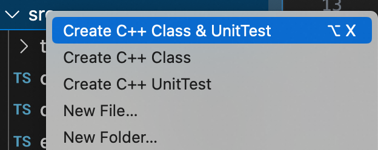
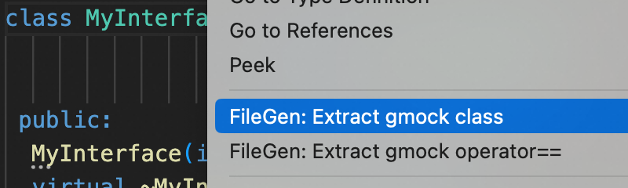
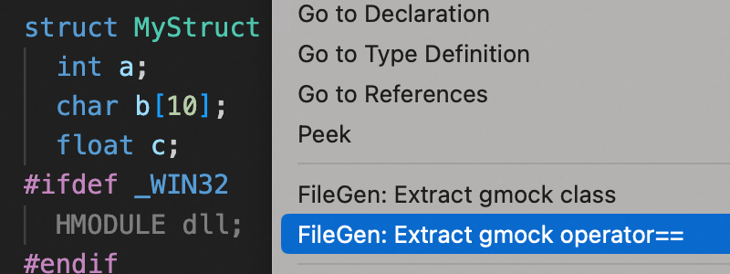

# VSCode File Generator

Create files in template.

## Features

### Create c++ class
Right click on the vscode explorer folder.


### Extract gmock class
Right click on the vscode editor text which is interface.


Sample output:
```cpp
class MockMyInterface : public MyInterface {
 public:
  MockMyInterface(int arg1, char *arg2);
  ~MockMyInterface();
  MOCK_METHOD0(publicMethodArg0, int());
  MOCK_METHOD1(publicMethodArg1, char *(std::unordered_map<std::string, std::string> arg1));
  MOCK_METHOD3(publicMethodArg3, std::unique_ptr<Foo>(int arg1, char *arg2, std::string arg3));
  MOCK_CONST_METHOD2(publicConstMethod, void(int arg1, const std::string& arg2));

};
```

### Extract gmock operator==
Right click on the vscode editor text which is struct.


Sample output:
```cpp
bool operator==(const MyStruct& a, const MyStruct& b) {
  return a.a == b.a
      && strcmp(a.b, b.b) == 0
      && a.c == b.c
#ifdef _WIN32
      && a.dll == b.dll
#endif
      && a.s == b.s;
}
```

## Configuration

### filegen.json

Create in your project root.

```json
{
   "module": "mymodule",  // The C++ modalar header
   "namespace": "wq",  // The C++ class namespace
   "organization": "Wequick",  // The organization show in copyright
   "gmock": {
     "mockFilePath": "test/test/mock",  // The path to extract gmock class
     "mockFilePrefix": "mock_",  // The file prefix of gmock class file (.h|.cc)
     "eqFilePath": "test/test/compare",  // The path to extract struct operator==
     "eqFilePrefix": "eq_",  // The file prefix of operator== file (.h|.cc)
   }
}
```

## Templates

Template file can be defined in `filegen/*` in your project root.

Example:
```
filegen
  |____${FILENAME}.h            // [cpp] header file
  |____${FILENAME}.cc           // [cpp] source file
  |____${FILENAME}_unittest.cc  // [cpp] unittest file
  |____${FILEPREFIX}${FILENAME}${FILESUFFIX}.h  // [cpp] gmock extract header file
  |____${FILEPREFIX}${FILENAME}${FILESUFFIX}.cc  // [cpp] gmock extract source file
```

If not defined, we will use the following as default.

### ${FILENAME}.h

C++ header file.

```cpp
//
// Created by ${USER} on ${DATE}.
// Copyright (c) ${YEAR} ${ORGANIZATION}. All rights reserved.
//

#ifndef ${HEADER_GUARD}
#define ${HEADER_GUARD}

#include <cstring>

namespace ${NAMESPACE} {

class ${CLASSNAME} {
 public:
  
 private:
};

}  // namespace ${NAMESPACE}

#endif  // ${HEADER_GUARD}"

```

### ${FILENAME}.cc

C++ source file.

```cpp
//
// Created by ${USER} on ${DATE}.
// Copyright (c) ${YEAR} ${ORGANIZATION}. All rights reserved.
//

#include "${HEADER_PATH}"

namespace ${NAMESPACE} {


}  // namespace ${NAMESPACE}

```

### ${FILENAME}_unittest.cc

C++ unittest source file.

```cpp
//
// Created by ${USER} on ${DATE}.
// Copyright (c) ${YEAR} ${ORGANIZATION}. All rights reserved.
//

#include <gtest/gtest.h>
${MODULE_INCLUDE}

namespace ${NAMESPACE} {

TEST(${CLASSNAME}Tests, test_any) {
  ASSERT_EQ(1, 1);
}

}  // namespace ${NAMESPACE}

```

### ${FILEPREFIX}${FILENAME}${FILESUFFIX}.h

Use for extract gmock class.

```cpp
// Created by ${USER} on ${DATE}.
// Copyright (c) ${YEAR} ${ORGANIZATION}. All rights reserved.
//

#ifndef ${HEADER_GUARD}
#define ${HEADER_GUARD}

${H_BODY}

#endif  // ${HEADER_GUARD}

```

### ${FILEPREFIX}${FILENAME}${FILESUFFIX}.cc

Use for extract gmock class.

```cpp
// Created by ${USER} on ${DATE}.
// Copyright (c) ${YEAR} ${ORGANIZATION}. All rights reserved.
//

#include "${HEADER_PATH}"

${CC_BODY}

```

## Variables

The variable format is `${KEY}`, the `KEY` supports following:

* **FILENAME** - The file name your input. e.g. `file_generator`
* **CLASSNAME** - The class name. From the file name in camel style, e.g. `FileGenerator`
* **USER** - The user. Configured by `git config user.name [USER]`. e.g. `Galen Lin`
* **ORGANIZATION** - The organization. Configured by `organization` filed in `filegen.json` file. e.g. `Wequick`
* **YEAR** - The year of now. e.g. `2023`
* **DATE** - The date of now. Format as 'YYYY-MM-DD', e.g. `2023-07-17`
* **HEAD_GUARD** - The google-style header guard. From the relative-path-to-project-root in upper case, e.g. `WEQUICK_FILE_GENERATOR_H_`
* **HEADER_PATH** - The current header path. From the relative-path-to-project-root join with the file name. e.g. `wequick/file_generator.h`
* **MODULE_INCLUDE** - The modular header includement. If `module` is specified in `filegen.json` then returns  '#include <`module`/`module`.h>\n', e.g. `#include <mymodule/mymodule.h>\n`
* **NAMESPACE** - The class namespace. Returns the `namespace` field specified in `filegen.json` or fallback to the project root directory name. e.g. `myproject`
